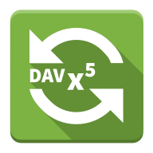

DAVx⁵
========

> [!IMPORTANT]
> Please see the [DAVx⁵ Web site](https://www.davx5.com) for
> comprehensive information about DAVx⁵, including a list of services it has been tested with,
> a manual and FAQ.

DAVx⁵ is licensed under the [GPLv3 License](LICENSE).

News and updates: 

* [@davx5app@fosstodon.org](https://fosstodon.org/@davx5app) on Mastodon

**Help, feature requests, bug reports: [DAVx⁵ discussions](https://github.com/bitfireAT/davx5-ose/discussions)**

Parts of DAVx⁵ have been outsourced into these libraries:

* [cert4android](https://github.com/bitfireAT/cert4android) – custom certificate management
* [dav4jvm](https://github.com/bitfireAT/dav4jvm) – WebDAV/CalDav/CardDAV framework
* [synctools](https://github.com/bitfireAT/synctools) – iCalendar/vCard processing and content provider access

**If you want to support DAVx⁵, please consider [donating to DAVx⁵](https://www.davx5.com/donate)
or [purchasing it](https://www.davx5.com/download).**

